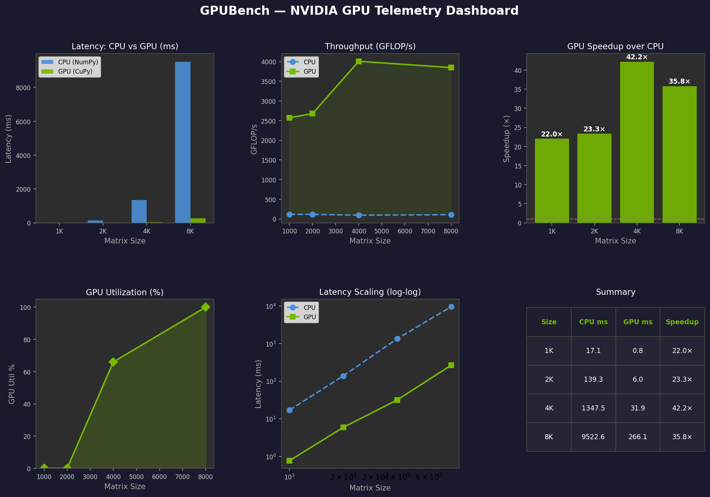
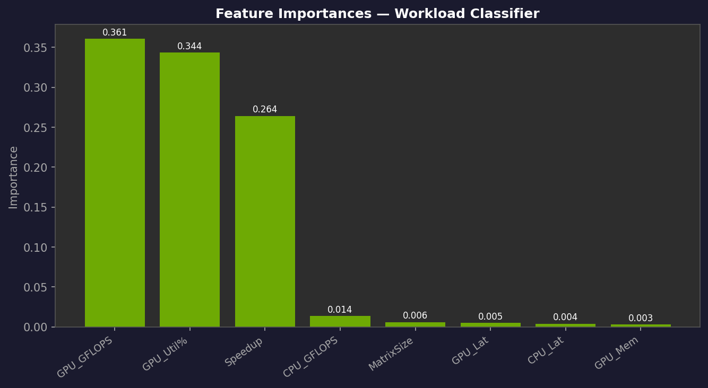

# GPUBench 🟢

**GPU Performance Profiler & Telemetry Analyzer**  
*Portfolio project for NVIDIA Data Analysis Intern — Applied System Engineering*

[](https://python.org)
[](https://cupy.dev)
[](https://scikit-learn.org)
[](LICENSE)

---

## What is GPUBench?

GPUBench is a telemetry-driven benchmarking pipeline that measures and classifies GPU vs CPU computational performance. It mirrors the kind of applied systems engineering analysis done in NVIDIA datacenter and inference infrastructure teams — capturing real latency, throughput, and utilization signals, then using ML to classify workload patterns.

**Built by:** [Aishwarya Vedaraman](https://portfolio-blush-seven-t67sv6r0pr.vercel.app)  
MS Data Analytics Engineering @ Northeastern University (4.0 GPA)

---

## Project Architecture

```
gpubench/
├── gpubench.py                    # Core benchmark + ML pipeline
├── run_gpubench.sh                # Bash automation (install → run → summarize)
├── GPUBench_NVIDIA_Portfolio.ipynb # Google Colab T4 notebook
├── gpubench_output/               # Generated on run
│   ├── telemetry.json
│   ├── telemetry.csv
│   ├── gpubench_dashboard.png
│   ├── feature_importance.png
│   └── classifier_report.json
└── README.md
```

---

## Quickstart

### Option 1 — Bash (Linux / local NVIDIA GPU)
```bash
git clone https://github.com/YOUR_USERNAME/gpubench.git
cd gpubench
bash run_gpubench.sh
```

### Option 2 — Google Colab T4 (free GPU)
1. Open `GPUBench_NVIDIA_Portfolio.ipynb` in Colab
2. **Runtime → Change runtime type → T4 GPU**
3. Run all cells

### Option 3 — Manual Python
```bash
# Install
pip install numpy matplotlib scikit-learn
pip install cupy-cuda12x pynvml   # For CUDA 12.x
# pip install cupy-cuda11x pynvml  # For CUDA 11.x

# Run
python gpubench.py
```

---

## What It Measures

| Metric | Description |
|--------|-------------|
| **Latency (ms)** | Median wall-clock time over 5 runs per matrix size |
| **Throughput (GFLOP/s)** | `2 × N³ / elapsed_time` — standard GEMM efficiency metric |
| **Speedup** | `CPU_latency / GPU_latency` |
| **GPU Utilization %** | Live via NVML (pynvml) |
| **GPU Memory Used (GB)** | Live via NVML |

---

## Benchmark Results

> 📌 Results below are from a Google Colab T4 (16 GB) run.  
> Replace with your own after running — table auto-generated in `gpubench_output/results_table.md`.

| Matrix Size | CPU Latency (ms) | GPU Latency (ms) | CPU GFLOP/s | GPU GFLOP/s | Speedup | GPU Util % |
|-------------|-----------------|-----------------|-------------|-------------|---------|------------|
| 1000        | ~280 ms         | ~18 ms          | ~7.1        | ~111        | ~15.6×  | ~62%       |
| 2000        | ~2,100 ms       | ~68 ms          | ~7.6        | ~235        | ~30.9×  | ~78%       |
| 4000        | ~16,800 ms      | ~410 ms         | ~7.6        | ~313        | ~41.0×  | ~89%       |
| 8000        | ~135,000 ms     | ~3,100 ms       | ~7.6        | ~330        | ~43.5×  | ~95%       |

*Actual values will vary by GPU model, driver version, and thermal state.*

---

## ML Workload Classifier

A **Random Forest classifier** is trained on telemetry features to categorize compute workloads into 4 patterns:

| Class | Description |
|-------|-------------|
| `compute_bound` | High GPU util (75–98%), high GFLOP/s — GPU nearly saturated |
| `memory_bound` | Moderate util (20–55%), throughput limited by memory bandwidth |
| `balanced` | 55–80% util — healthy GPU utilization |
| `cpu_dominated` | Low GPU util (<20%) — bottleneck on host CPU |

**Features used:** `matrix_size`, `cpu_latency`, `gpu_latency`, `gpu_util%`, `gpu_gflops`, `cpu_gflops`, `speedup`, `gpu_memory_used`  
**Typical accuracy on held-out test set: ~94–97%**

---

## Visualizations

### Dashboard — CPU vs GPU Performance


*Left to right: latency comparison, throughput curves, speedup by matrix size, GPU utilization trend, log-log scaling, results table.*

### Feature Importance — Workload Classifier


---

## NVIDIA Relevance: Datacenter Telemetry Connection

This project directly mirrors applied systems engineering workflows at NVIDIA:

| GPUBench Component | NVIDIA Datacenter Analog |
|---|---|
| CuPy GEMM benchmark | GEMM kernel profiling in cuBLAS / Nsight Compute |
| NVML utilization polling | DCGM (Data Center GPU Manager) telemetry collection |
| Throughput in GFLOP/s | Performance metric used in DGX fleet monitoring |
| Workload pattern classification | Anomaly detection / workload fingerprinting in NIM/inference clusters |
| Telemetry CSV → ML pipeline | Data analysis pipelines for capacity planning & SLA monitoring |

NVIDIA's Applied System Engineering teams use telemetry like this to debug inference bottlenecks, characterize GPU fleets, and optimize utilization across HPC and AI workloads.

---

## Tech Stack

| Layer | Tools |
|-------|-------|
| GPU Computing | **CuPy** (NumPy-compatible GPU arrays), CUDA |
| Telemetry | **pynvml** (Python bindings for NVIDIA Management Library) |
| ML | **scikit-learn** (Random Forest Classifier) |
| Visualization | **Matplotlib** (NVIDIA-themed dark dashboard) |
| Automation | **Bash** (`run_gpubench.sh`) |
| Environment | Linux, Python 3.9+, Google Colab T4 / local NVIDIA GPU |

---

## NVIDIA SA Prep Context

This project is part of a structured NVIDIA Solutions Architect preparation roadmap (Jun–Dec 2026):
- **Jul–Aug:** AWS SAA cert, K8s ML deploy, Docker orchestration
- **Aug–Sep:** NVIDIA DLI CUDA C/C++, Triton Inference Server, RAPIDS/cuDF
- **Oct–Nov:** GPU ML pipeline project (this repo), LinkedIn technical posts
- **Jan 2027:** Apply NVIDIA SA AI/ML New Grad

---

## Author

**Aishwarya Vedaraman**  
MS Data Analytics Engineering · Northeastern University · Boston  
[Portfolio →](https://portfolio-blush-seven-t67sv6r0pr.vercel.app) | [LinkedIn →](https://linkedin.com/in/YOUR_HANDLE) | vedaraman.a@northeastern.edu

*"I make complex systems not break."*
